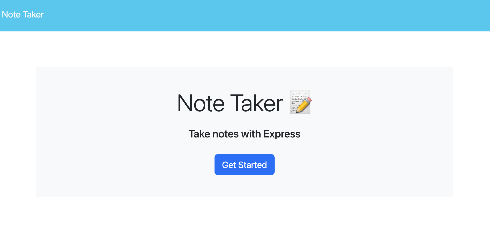

# note-taker

## Project Description

The goal of the project is to create a js file that connects the front-end with the back-end functionality. The note taker application opens with a entry screen. When the user clicks "get started", they are brought to an area to take notes, save notes and delete the notes.

This project solves the user's problem of tracking notes or daily tasks.

## Technical Requirements

Technical requirements include:
* Express package
* Node.js
* Nodemon
* Heroku Deployment
* Package JSON
* POSTMAN

## Usage

Screenshots: 

Heroku Site: https://noter-taker-d6c57055bb47.herokuapp.com/

Github Repo:https://github.com/lavollmer/note-taker

## Credits

This project was done as a part of the U of MN coding bootcamp Fall 2023. 

Tutoring services were used to understand express.js, and REST concepts.

Gary Almes, U of MN bootcamp professor, directed us to for id generation in class: (https://www.npmjs.com/package/uuid)

Heroku login issues debugged inspired from: (https://stackoverflow.com/questions/51815542/heroku-missing-required-flag-a)

Delete note code inspired by code in: https://javascript.plainenglish.io/javascript-remove-element-from-array-by-id-9c548f2aa27b

Code was provided by tutoring services:
  let notesKeep = []
  for (var i = 0; i < database.length; i++) {
    if (database[i].id != req.params.id) {
      notesKeep.push(database[i])
    }
  }

## License
None